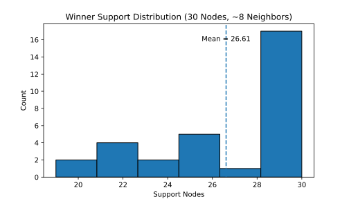

# TrustMesh PoC

[English](./README.md) | [简体中文](./README_ZH.md)

## 简介

TrustMesh 是一个去中心化共识机制，它最大的不同是使用涌现来代替传统的 PoW/PoS，且不再要求区块之间引用。它的安全性与节点行为绑定，具体规则根据网络目的制定，但不要求节点持有全局视图。理论上，这样的结构能够实现极高的扩展性。更多内容可参考白皮书：[TrustMesh Whitepaper v0.0.1](./docs/Whitepaper/v0.0.1/TrustMesh_ZH.md)

目前，PoC 1.0 已发布，基于 Go 编写。代码遵循 [MIT License](./LICENSE) 许可分发，下文介绍使用方法。

## 实验数据

以下展示了当前 PoC 在典型配置下的收敛表现，这是 TrustMesh 的核心特性之一。

|   轮次   | 赢家分布 |
| :------: | :------: |
| 29423550 |    30    |
| 29423551 |    30    |
| 29423552 |   29/1   |
| 29423553 |  22/7/1  |
| 29423554 |    30    |
| 29423555 |   29/1   |
| 29423556 |    30    |
| 29423557 |   29/1   |
| 29423558 |    30    |
| 29423559 |  24/4/2  |
| 29423560 |   29/1   |
| 29423561 |  25/1/4  |
| 29423562 | 2/19/4/5 |
| 29423563 |  25/4/1  |
| 29423564 |  7/22/1  |
| 29423565 |    30    |
| 29423566 |   28/2   |
| 29423567 |  8/21/1  |
| 29423568 |   25/5   |
| 29423569 |   29/1   |
| 29423570 |   29/1   |
| 29423571 |   25/5   |
| 29423572 |   29/1   |
| 29423573 |   25/5   |
| 29423574 |   21/9   |
| 29423575 |   23/7   |
| 29423576 |    30    |
| 29423577 |   29/1   |
| 29423578 | 10/19/1  |
| 29423579 |    30    |
| 29423580 |   29/1   |

以下为根据上述数据整理出的“第一名提案支持人数”直方图：

<p align="center">

</p>
1. **平均有 26.61 / 30 个节点（88.7%）收敛到同一个提案。**
    这是在仅依赖局部信息、无同步投票、无全局链式结构的情况下得到的。
2. **所有轮次中，Winner 的支持者数量始终大于其余所有提案支持者之和。**
    这说明优势被显著放大，形成强多数主导。
3. **即使出现多个提案并存（例如 22/7/1 或 10/19/1），最终赢家仍然拥有绝对优势。**
    小团体仅构成局部稳定点，而无法影响全局收敛。

## 快速启动

### 1. 安装 Docker 与 Docker Compose

请根据您的操作系统参考官方文档安装 Docker：

- 官方安装指南：[https://docs.docker.com/compose/install/](https://docs.docker.com/compose/install/?utm_source=chatgpt.com)

安装完成后可通过以下命令确认：

```bash
docker --version
docker compose version
```

------

### 2. 下载配置生成工具

你无需手动编写 `docker-compose.yml`，配置工具会为你生成。

从发布页获取可执行文件：

Linux

```bash
wget https://github.com/BinGo-Lab-Team/TrustMesh/releases/download/PoC-1.0.0/Linux_amd64_MakeCompose
chmod +x Linux_amd64_MakeCompose
```

Windows Powershell

```powershell
iwr https://github.com/BinGo-Lab-Team/TrustMesh/releases/download/PoC-1.0.0/Windows_amd64_MakeCompose.exe -OutFile MakeCompose.exe
```

该工具用于生成 `docker-compose.yml`、节点配置文件以及必要的参数。

------

### 3. 运行配置工具

直接执行：

```bash
./Linux_amd64_MakeCompose
```

或

```powershell
.\MakeCompose.exe
```

工具会询问你需要的配置项。你可以阅读这些注释了解含义： [.env](./src/TrustMesh-PoC-1/.env) | [.env_bootstrap](./src/TrustMesh-PoC-1/.env_bootstrap)

(`.env` 与 `.env_bootstrap` **不会被程序读取**，仅用于解释环境变量含义；实际配置来自 `docker-compose.yml`)

按照提示输入即可，无需记忆参数。生成完成后，目录下会出现 `docker-compose.yml`。

------

### 4. 启动本地 TrustMesh 网络

执行：

```bash
docker compose up -d
```

如本地无镜像，Docker 将自动从 Docker Hub 拉取。

查看节点状态：

```bash
docker compose ps
```

查看实时日志：

```bash
docker compose logs -f
```

### 5.引导

节点本身并不知道其他节点的网络位置，因此首次启动需要向引导节点汇报并接收来自引导节点的邻居信息以建立网络拓扑。

如果程序没有发现数据库文件将自动创建数据库并启动请求流程，节点会向 `BOOTSTRAP` 里填写的地址汇报自身 HOST。在节点数量过多的情况下，节点可能会先于引导节点启动导致找不到引导节点，这时需要手动启动引导节点后再启动其他节点。请求完成后重启节点，节点便会开始工作。

如果需要重新向引导节点请求，关闭节点并删除节点的 `data.db` 文件后重启节点会自动开始请求。

------

### 6. 停止与清理测试环境

停止：

```bash
docker compose down
```

彻底清理：

```bash
docker compose down -v
```

### 7.分析

最终胜出的区块数据会以 JSON 文件形式存放于：

```
volumes folder/node-x/block/xxx.json
```

你可以从发布页下载 `Analyzer` 工具，并输入 MakeCompose 中设定的 volumes 目录，以进行统计分析。

Linux

```bash
wget https://github.com/BinGo-Lab-Team/TrustMesh/releases/download/PoC-1.0.0/Linux_amd64_Analyzer
chmod +x Linux_amd64_Analyzer
```

Windows Powershell

```powershell
iwr https://github.com/BinGo-Lab-Team/TrustMesh/releases/download/PoC-1.0.0/Windows_amd64_Analyzer.exe -OutFile Analyzer.exe
```

启动后输入 volumes 路径以及需要分析的 Round Number 即可进行分析。

## 补充信息

如有问题可以提交 Issues 或发邮件给我 yangzhixun-@outlook.com
